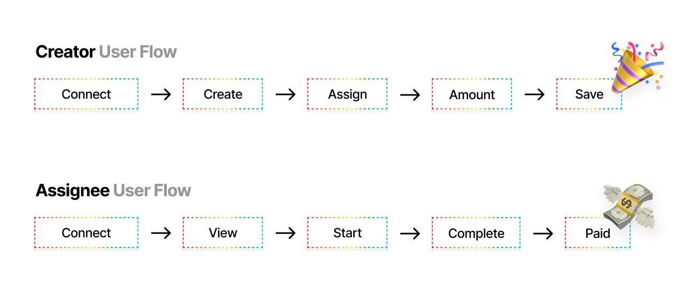

<p align="center">
  
</p>
<p align="center">
  <i align="center">Station dApp and Smart Contracts</i>
</p>

## Overview
Station is an automated task compensation software that streamlines workplace collaboration. It facilitates communication, assignments, and on-demand payouts in USD Coin (USDC) on Arbitrum One, triggered when a task is moved from "Doing" to "Done", ensuring timely compensation for completed work.

- **Website**: [station.finance](https://station.finance)
- **X (Twitter)**: [x.com/0xStation_](https://x.com/0xStation_)
- **Telegram**: [t.me/stationfi](https://t.me/stationfi)

## Addresses

| Contract       | Address       |
| -------------  | ------------- |
| Station      | [0xc82480693692c443e4d4dc5fa5bC6496A4cac865](https://arbiscan.io/address/0xc82480693692c443e4d4dc5fa5bC6496A4cac865) |
| USD Coin      | [0xaf88d065e77c8cC2239327C5EDb3A432268e5831](https://arbiscan.io/token/0xaf88d065e77c8cc2239327c5edb3a432268e5831) |

## Demonstration

[Watch Demo on YouTube](https://www.youtube.com/watch?v=A7WWU7aZqnE)

## Feedback

[Complete the form](https://forms.gle/EobUkAR5ATgbQSnY9)

## Explainer



## Getting Started

To use the interface, follow these simple steps:

1. **Logging In**
   - Ensure you have a compatible web3 wallet.
   - Press "Connect" to access Station's features.

2. **Choose Your Action**
   - **Task Management**: Create and assign tasks. Label to communicate requirements.
   - **Collaboration**: Track progress as assignees move tasks from "To Do" to "Doing" and "Doing" to "Done".
   - **Compensation**: Configure payouts to automate compensation for completed tasks.

3. **Monitor and Manage**
   - Use the dashboard to track task status and compensation history.

## Usage

> [!TIP]
> Ensure the Station contract is funded with USD Coin (USDC).

1. **Creating a Task**
   - Call the createTask function from the smart contract.
   - Provide the task desc. assignee's address, and the reward amount in USDC.
2. **Starting a Task**
   - Assignees can invoke the startTask function to change the task status from "To Do" to "Doing."
3. **Completing a Task**
   - When a task is moved to "Done", the assignee calls the completeTask function.
   - The contract verifies the task status and transfers the specified USDC reward to the assignee.
4. **Managing Tasks**
   - Admins can monitor all tasks and their statuses using the interface.

## Installation

Run the Station project locally by following these commands:

```bash
# Clone the repository
git clone https://github.com/camconrad/station-collabtech

# Navigate into the directory
cd station_dapp

# Install dependencies
yarn install

# Compile smart contracts
npx hardhat compile

# Start the application
yarn start
